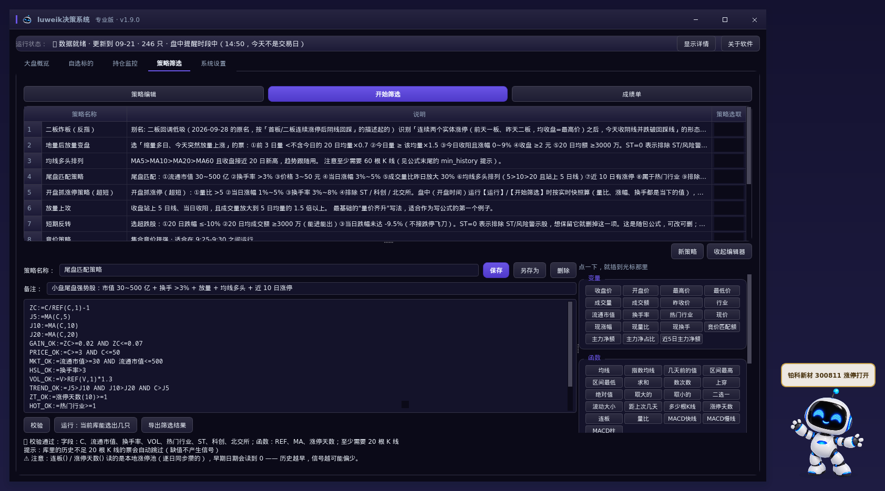
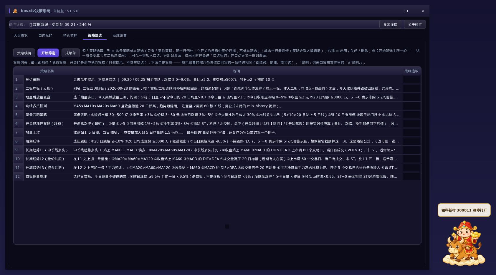
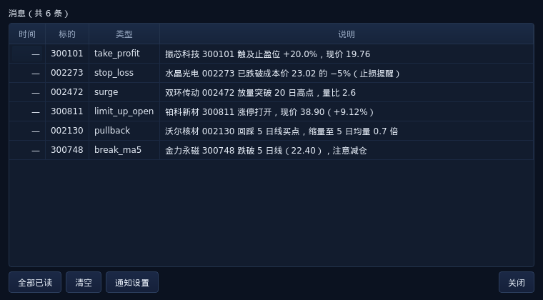
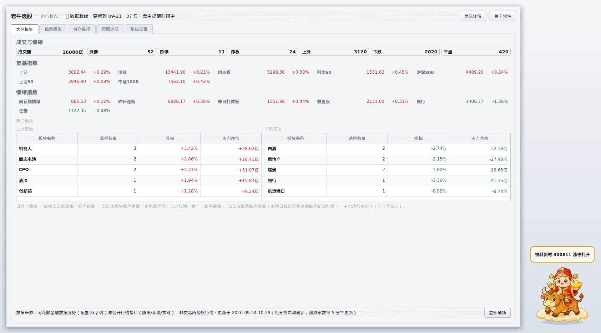
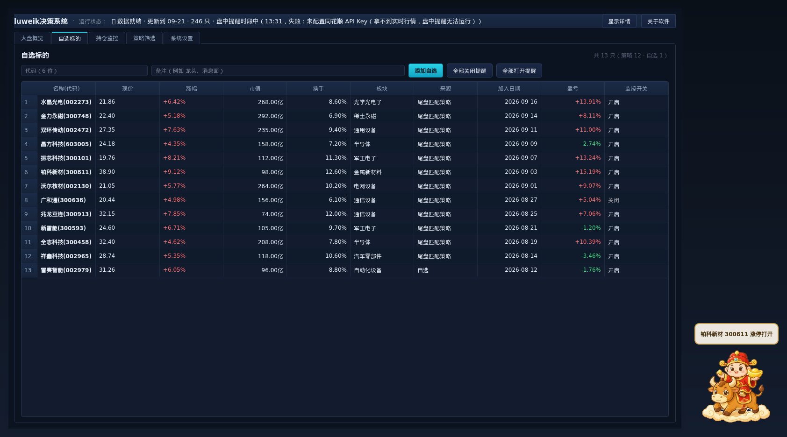
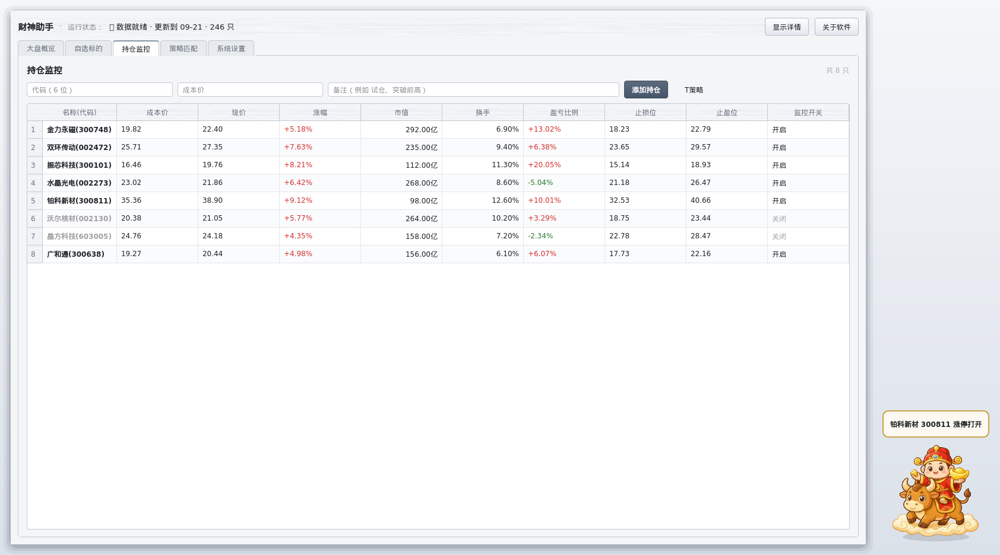
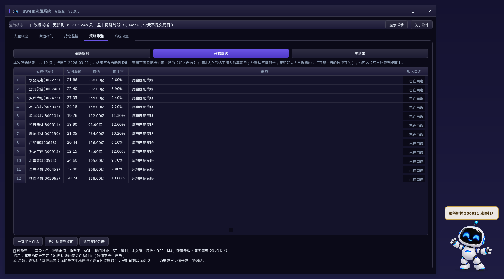
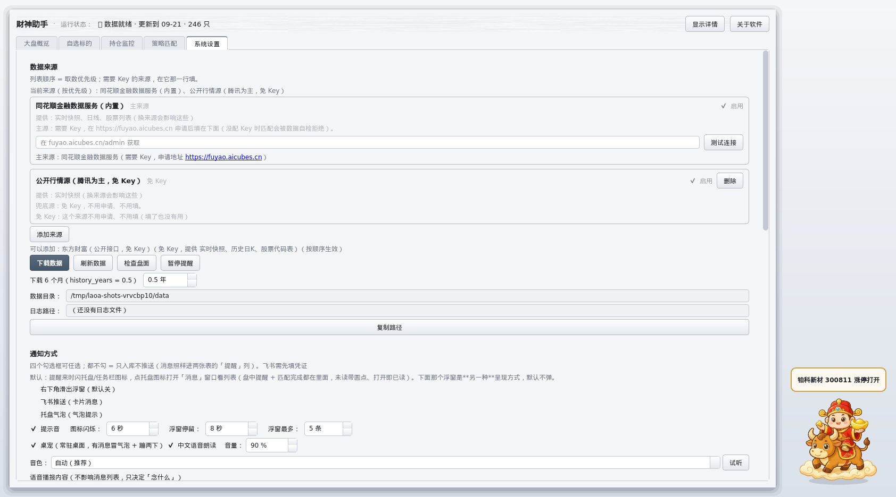
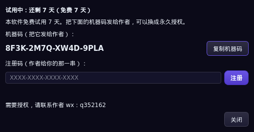

# luweik决策系统 —— 行情软件的辅助工具

**一句话**：它不替代你手里的行情软件。同花顺、通达信你照常用，luweik决策系统负责把你顾不过来的那些票盯住，该动的时候在桌面上喊你一声。

**当前版本：v1.7.0**（Windows 单机版）。

---

## 盯盘的人，麻烦往往就在这三处

- 自选十几只、持仓好几只，行情软件一屏装不下。哪只跌破了止损、哪只涨停又打开了，得来回切页面才看得见。
- 想按自己的条件匹配 —— 流通市值 30~500 亿、今天涨 3% 到 5%、量比平时放大一倍 —— 不会写公式；会写一点，也不确定粘进去到底能不能跑。
- 收盘想复盘，手边没有一份"按我的条件"留下来的清单，第二天开盘还是凭感觉。

luweik决策系统补的就是这三块：策略编辑尽量省事，盘中自动盯，选出来的结果能留档。

---

## 特色一：最简单的策略编辑

左边写策略，右边一排全中文按钮：`收盘价`、`均线`、`并且`、`非 ST`…… 点一下插到光标处，语法不用背。

已经会写通达信、同花顺公式的，直接粘进来就能用。`:=` 中间变量、`:` 输出线、`COLORRED` 这类颜色写法都认；`DRAWICON`、`STICKLINE` 这些画图语句自动忽略，不影响筛选结果。`MA/EMA/REF/HHV/LLV/SUM/COUNT/CROSS/SMA/DMA/KDJ/RSI/BOLL` 等 **75 个函数**可用。

写完点【运行】，当场知道这条策略能选出几只 —— 不用等收盘，也不用拿钱去试。

想更认真看一眼某条策略到底行不行，点顶部的【成绩单】：它把勾选的策略在本地历史数据上回测一遍，逐条给出样本数、平均收益、胜率、t 值与逐年表现，可以一键复制成纯文本发出去。这个入口是**按需**打开的 —— 打开时它先告诉你库里的数据够不够（够不够 1 年、不够怎么补），计算在后台跑、随时能取消。**数据不足 1 年时它只会说「样本不足，不能当结论」，不会给你一个好看的假数字**。

列表里每条策略都能改、能删、能勾选，勾上的才参与筛选。随包已经带了几条现成的 —— 尾盘匹配、开盘抓涨停（超短）、首板缩量整理、短期反转之类，和你自己写的那些待遇完全一样。

---

## 特色二：盘中监控，到点就喊你

默认只盯**持仓**：止损、止盈、涨停打开、跌破 5 日线这些，触发就在桌面上弹消息，同时用中文念出来 —— 人不在屏幕前，也知道发生了什么。持仓票不用再手动加进自选，止损止盈直接按你的成本价算。

选出来的票、加进自选但没打开的票，默认都**不会**来打扰你。要盯哪一只，去「自选标的」点它那一行的「监控开关」（也可以一次全部打开/关闭）；跑完一轮匹配只会告诉你一句「选股结果已出，请点击查看」，安静地等着你去看。

它在不在干活，看状态栏那一句就清楚：`盘中提醒时段中（10:31 盯 12 只，命中 0 条）`。点【检查盘面】会明确回你这一轮的结果 —— 是今天没有票触发条件，还是今天不是交易日、现在不在交易时段，又或者没配同花顺 Key。

消息按 QQ 那样收：托盘图标闪起来，点开是一个消息列表，未读带红点，一条条看，也能一键全部已读。

桌宠常驻桌面，主窗口最小化也不影响它。有情况就冒个气泡、把消息喊出来；能拖动、能藏起来，右键能静音一小时。

---

## 界面

窗口最上面那条标题栏是**自己画的**：与皮肤同色，左边一道强调色小竖条 + 程序图标 + 软件名 +
版本号，右上角是最小化 / 最大化 / 关闭。拖动、双击最大化、边缘缩放、贴边吸附仍然是 Windows 原生的
（看着是自己的，动起来是系统的）。

深色皮肤（默认 **午夜靛紫**）：近黑偏紫的底 + 靛紫强调，数据卡片比底色亮一档，
边界用细线而不是阴影 —— 目标是"看着像专业终端，不像游戏界面"。
涨跌色仍然**红涨绿跌**，但在深色底上换亮一档，数字不会糊在背景里；
板块热力图也跟着换一套同色系的方块（横盘=深灰、涨=亮红、跌=亮绿）。

皮肤一共八套，设置页里随时换、**立即生效**：午夜靛紫（默认）/ 深海宝蓝 / 石墨琥珀金 /
暗夜玫红 / 哑光雾蓝 / 浅色高级灰 / 银色（金属感）/ 系统默认。
看不惯深色可以选「浅色高级灰」或「银色」，想彻底回到 Windows 原样就选「系统默认」；
标题栏想换回系统那条，在「系统设置 → 其他 → 窗口外观」里选「系统标题栏」（重启生效）。

## 其它功能

### 大盘概览

成交额、涨停与跌停家数、炸板家数、上涨下跌家数；宽基指数（上证、深成、创业板、科创 50、沪深 300、上证 50、中证 1000）加上情绪指数。

下面是一整张**板块热力图**：**方块大小 = 该行业的流通市值合计，颜色 = 涨跌幅（红涨绿跌）**，九十来个行业一屏看全 —— 钱压在哪、今天往哪边动，一眼就有数（原来是「上涨前五 / 下跌前五」两张表，只有 10 行，中间那一大片根本看不见）。鼠标停在方块上看细节：成分股几只、最大的一只是谁、当日涨停家数、主力净额；点【放大】开到独立大窗，点【打开大盘云图】跳浏览器对着别人家的图看（我们只给入口，不内嵌、不抓它的数据）。

图下面一行小字写清口径与出处：面积怎么算、颜色怎么来、几个行业、快照是几点的、数据取自哪个来源。取不到的方块画灰标 `—`，**不会拿 0% 顶替**（横盘和不知道是两回事）。

### 越做越稳的筛选

匹配这件事容易踩两个坑，程序里都做了处理，而且都写在明面上：

- **名单不再"今天进明天出"**：`C 站上 MA20` 这类条件在均线附近会来回抖，程序可以要求
  **最近 N 个交易日都命中**才算选中（`signal_confirm_days`，默认关）。开启后来源列会写「（连续 N 日确认）」，
  让你知道名单为什么变短。
- **弱势市场自动抬门槛**：本地数据判出大盘明显走弱时，只保留**近 20 个交易日跑赢全市场**的票
  （`market_regime_gate`，默认开）。强市、中性、数据不足时**一只都不挡**；
  挡了票就在提示里写清"为什么判弱、挡掉几只、怎么关掉"，绝不悄悄动手。

### 自选标的

名称(代码)、现价、涨幅、**市值与换手**（流通市值 / 换手率）、板块、**来源**、**加入日期**、**从加入那天算到现在的盈亏**，最后一列是监控开关。

「来源」写的是这只票被哪条策略选出来的，只写策略名、不带前缀；手工加进去的写「自选」。添加可以按代码、也可以按备注，一键完成；删除右键即可。

### 持仓监控

成本价、现价、涨幅、市值、换手、盈亏比例，以及**自动算好的止损位与止盈位**。监控开关每只票单独控制。

### 筛选结果：加不加自选，你定

跑完匹配，结果只列出来，不会自动进自选。每行一个【加入自选】，选中的才进股池；也可以【一键加入自选】，或者【导出结果到桌面】—— 导出的是文本文件，落在 `桌面\luweik\luweik-筛选结果-<日期>.txt`。

### 系统设置

五组：「数据来源」（同花顺 Key、导入几年历史）、「通知方式」（飞书、托盘、桌宠、中文语音）、「竞价扫描」、「T策略」（止损止盈比例与做 T 阈值）、「其他」（界面主题、当日异动提醒、自选上限）。一处改完，一键保存。

---

## 怎么开始用

1. **下载解压**：得到 `LuweikDecision` 文件夹，双击里面的 `luweik决策系统.exe`。不需要安装。
2. **先填同花顺 Key（推荐第一步就做）**：去 https://fuyao.aicubes.cn 申请一个，填在「系统设置 → 数据来源」那一行的输入框里，点【保存设置】即可。
   **为什么建议先配**：策略筛选、回测与自选标的的资金流都要完整的复权历史与行业归属，这两样只有同花顺那条路给得到 —— 没配 Key 时程序会在数据自检那一步**直接拒绝筛选**（免得拿算错的复权价去选票）。不配也能开、能看行情与大盘概览、能盯提醒，只是选不出票。
3. **免费试用 7 天**：功能全开。到期后点【策略编辑】会提示授权，把**机器码**发我，我给你注册码，填进去就永久可用 —— 一次注册，单机终身。
4. **加自选**：在「自选标的」里填代码添加，或者跑一次筛选，从结果里挑。

---

## 常见问题

**非交易时段跑筛选，一只都选不出来？**
如果策略里用到「流通市值、换手率、现价、现涨幅、现量比、现换手」，就会这样：这几个数都来自实时快照，收盘后取不到，条件一律不成立 —— 等交易时段再跑就正常了。不用这几个字段的策略不受影响。另外，开盘时间里跑筛选用的本来就是实时数据：拿现价拼出「今天」这根 K 线，`收盘价`、`量比()` 都是盘中口径；收盘之后才切回当天收盘的 K 线。

**盘中选出来的名单，收盘再跑就不一样了？**
这是设计如此。开盘时间用实时数据（此刻的现价、成交量），不在开盘时间才用本地 K 线，所以盘中不同时刻点【运行】本来就会得到不同结果。每次运行都会写明这次用的是哪套口径，比如「📊 本次口径：盘中实时（10:05）」。另外：现价、现涨幅、现量比、现换手这四个字段没有历史，**回测用不了**；写"股价 3~50 元"这类绝对价位条件时用 `现价`，别用 `收盘价` —— 盘中它是后复权价，跟你屏幕上的现价不是同一个数。

**自选标的里「市值」「换手」显示 `—`？**
同样是拿不到实时快照，收盘后或者数据源临时取不到时就是这样。`—` 的意思是"没有这个数"，不是 0。

**设置里选男声，听着还是女声？**
Windows 默认只装了一个中文女声。设置页列的是这台机器上**实际装着的音色**；要男声得先去「Windows 设置 → 时间和语言 → 语音」里加一个中文男声，加完这边就能选到。

**它会不会替我下单？**
不会。它不接券商，也不自动交易，只做"选出来 + 提醒你"。

**数据是哪来的？**
配了 Key 走同花顺的行情服务，没配就走公开行情接口（腾讯为主，新浪兜底）。两者都不是交易所授权行情，用于研究与自用。

---

## 免责声明

本软件是行情数据的整理与提醒工具，**不构成任何投资建议，不保证收益**。策略选出来的是"值得关注的清单"，不是买入信号；历史表现不代表未来。股市有风险，买卖决策与后果由使用者自行承担。

数据来自第三方公开接口，可能存在延迟、缺失或错误，请以券商交易软件的实时行情为准。
