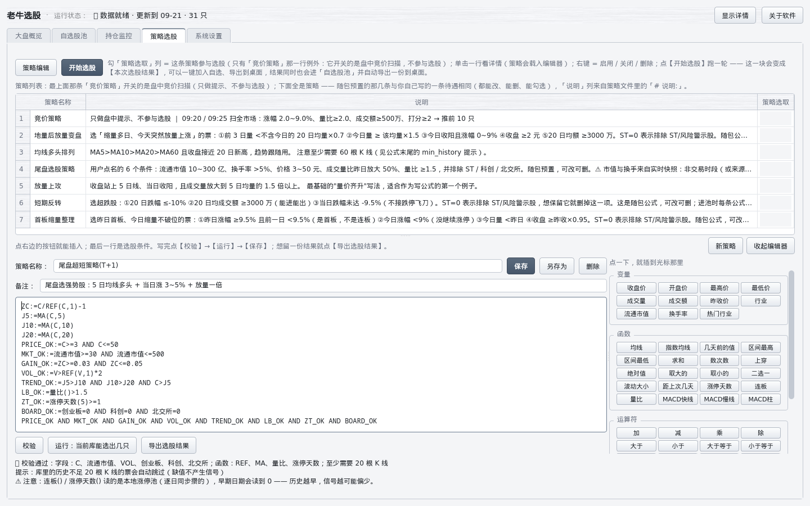
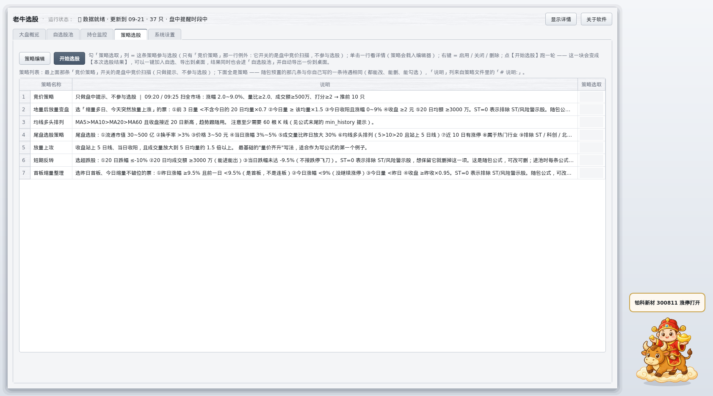
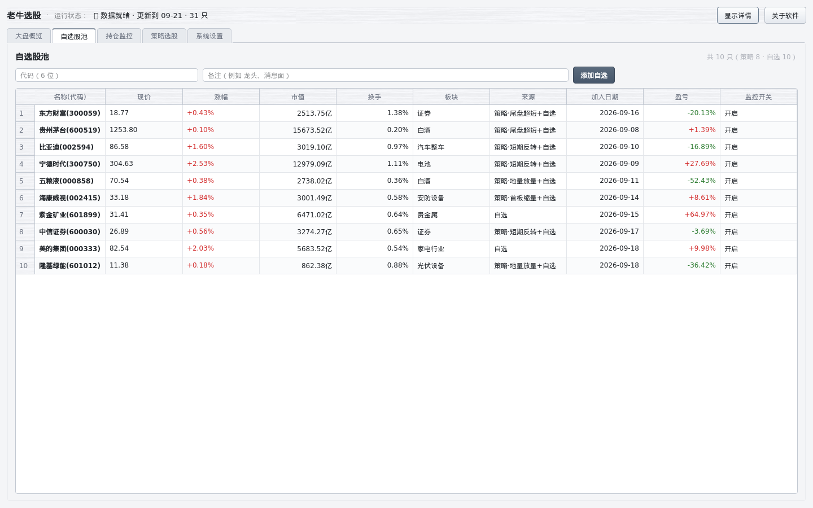
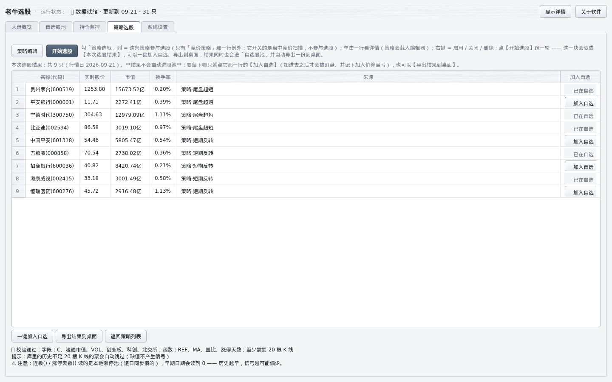

# 老牛选股 —— 行情软件的辅助工具

**一句话**：它不是行情软件，是给你的行情软件（同花顺 / 通达信）配的一个助手 —— 帮你把"看哪些票、什么时候该动手"这件事变得省事，盘中有情况就在桌面上喊你。

**当前版本：v1.2.1**（Windows 单机版）。

---

## 它解决什么问题

盯盘的人通常有三个麻烦：

- 自选股十几只、持仓好几只，**行情软件一屏看不完**，哪个跌破止损、哪个涨停打开，全靠自己来回切；
- 想按自己的条件选股（比如"流通市值 30~500 亿、今天涨 3~5%、放量一倍"），**要么不会写公式，要么写了不知道能不能跑**；
- 收盘后想复盘，**没有一份自己条件的清单**，第二天还是凭感觉。

老牛选股就是补这三块：**策略编辑最省事**、**盘中自动盯**、**结果能留档**。

---

## 特色一：最简单的策略编辑

- **右边点按钮就插入**：左边写、右边点，`收盘价`、`均线`、`并且`、`非 ST`…… 全中文按钮，点一下插到光标处，不用记语法。
- **通达信 / 同花顺的公式可以直接粘进来**：支持 `:=` 中间变量、`:` 输出线、`COLORRED` 这类写法，画图语句（`DRAWICON`、`STICKLINE`…）自动忽略；`MA/EMA/REF/HHV/LLV/SUM/COUNT/CROSS/SMA/DMA/KDJ/RSI/BOLL` 等 **75 个函数**都能用。
- **写完点【运行】就知道能选出几只**，不用等收盘、不用拿钱试。
- 策略列表里每条策略都能改、能删、能勾选（勾上才参与选股）—— **随包预置 7 条策略**，跟你自己写的一条待遇完全相同。

---

## 特色二：盘中监控（到点就喊你）

- **自选与持仓一起盯**：止损、止盈、涨停打开、跌破 5 日线、放量突破、回踩买点、做 T 高抛低吸、竞价异动 —— 触发就在桌面上弹消息、**用中文念出来**（不用盯着屏幕也知道发生了什么）。记在「持仓」里的票**不用再手动加自选**，止损止盈按你的成本价算。
- **一眼看得出它在工作**：状态栏写着"盘中提醒时段中（10:31 盯 12 只，命中 0 条）"；点【检查盘面】会明确告诉你这一轮的结果 —— 是"没有触发条件的票"，还是"今天不是交易日 / 不在交易时段 / 没配同花顺 Key"。
- **QQ 那样的消息列表**：托盘图标闪、点开就是一个消息列表（未读带红点），一条条看、一键全部已读。

- **一个小桌宠守在桌面**：主窗口最小化也不影响，有情况它会冒气泡并把消息喊出来；能拖动、能藏起来，右键就能静音一小时。

---

## 其它功能

### 大盘概览：一屏看清今天

成交额、涨停/跌停/炸板家数、上涨下跌家数，宽基指数（上证/深成/创业板/科创50/沪深300/上证50/中证1000），情绪指数，外加**热门板块上涨前五与下跌前五**（带涨停/跌停家数与主力净额）。

### 自选股池：不只是列表

名称(代码)、现价、涨幅、**市值、换手**（流通市值 / 换手率）、板块、**来源（是哪条策略选出来的，只写策略名、不带前缀；手工加进去的写「自选」）**、**加入日期**、**从加入到现在的盈亏**、监控开关。可以按代码、备注一键添加，右键删除。

### 持仓监控：成本、盈亏、止损止盈位

成本价、现价、涨幅、市值、换手、盈亏比例，以及**自动算好的止损位与止盈位**，每只票单独开关监控。

### 策略选股结果：自己决定加不加

跑完选股，**结果只列出来、不自动进自选**：每行一个【加入自选】按钮，选中的才进股池，也可以【一键加入自选】或【导出结果到桌面】（文本文件，落在 `桌面\老牛选股\老牛选股助手-选股结果-<日期>.txt`）。

### 系统设置：数据来源、通知、语音

「数据来源」（同花顺 Key、导入几年历史）、「通知方式」（飞书 / 托盘 / 桌宠 / 中文语音）、「竞价扫描」、「T策略」（止损止盈比例与做 T 阈值）、「其他」（界面主题、当日异动提醒、自选上限），一处改完一键保存。

---

## 怎么开始用

1. **下载解压**：得到 `LaoniuTrader` 文件夹，双击里面的 **`老牛选股.exe`**，不需要安装。
2. **（可选）填同花顺 Key**：想要**完整历史数据**（选股与回测要用）就去 https://fuyao.aicubes.cn 申请一个，填在「系统设置 → 数据来源」那一行；不填也能用（行情与提醒走免 Key 的公开源）。
3. **免费试用 7 天**：所有功能都能用。到期后点【策略编辑】会提示需要授权，把**机器码**发我，我给你注册码，填进去就永久可用（一次注册，单机终身）。
4. **加自选**：在「自选股池」里填代码添加，或者跑一次选股，从结果里挑。

---

## 常见问题

**非交易时段跑选股，一只都选不出来？**
用到了「流通市值 / 换手率 / 现价 / 现涨幅 / 现量比 / 现换手」的策略会这样：这几个数都来自**实时快照**，收盘后拿不到，所以条件一律不成立 —— 交易时段再跑就正常了。不依赖这几个数的策略不受影响：**开盘时间里跑选股用的就是实时数据**（用现价拼出"今天"这根 K 线，`收盘价`、`量比()` 都是盘中口径），收盘后才改用当天收盘的 K 线。

**盘中跑出来的名单和收盘后不一样？**
这是设计如此：**开盘时间里跑的选股用实时数据**（此刻的现价 / 量），不在开盘时间才用本地 K 线，所以盘中不同时刻点【运行】会得到不同结果；每次运行都会写明用的是哪套口径（例如「📊 本次口径：盘中实时（10:05）」）。另外**现价 / 现涨幅 / 现量比 / 现换手这四个字段没有历史、不能回测**；写"股价 3~50 元之间"这类绝对价位条件请用 `现价`，不要用 `收盘价`（盘中它是后复权价，跟你屏幕上的现价不是同一个数）。

**自选股池里"市值""换手"显示 `—`？**
同样是"拿不到实时快照"。收盘后、或者数据来源临时取不到时就是这个样子 —— `—` 表示"没有这个数"，不是 0。

**设置里选"男声"听起来还是女声？**
Windows 默认只装了一个中文女声。设置页会列出这台机器上**实际装着的音色**；要男声就自己去「Windows 设置 → 时间和语言 → 语音」里添加中文男声，加完在这里能选到。

**它会不会替我下单？**
不会。它不接券商、不自动交易，只做"选出来 + 提醒你"。

**数据是哪来的？**
配置了 Key 走同花顺的行情服务，没配 Key 走公开行情接口（腾讯为主、新浪兜底）。**都不是交易所授权行情**，用于研究与自用。

---

## 免责声明

本软件是行情数据的整理与提醒工具，**不构成任何投资建议，不保证收益**。策略选出来的是"值得关注的清单"，不是买入信号；历史表现不代表未来。股市有风险，买卖决策与后果由使用者自行承担。

数据来自第三方公开接口，可能存在延迟、缺失或错误，请以券商交易软件的实时行情为准。
